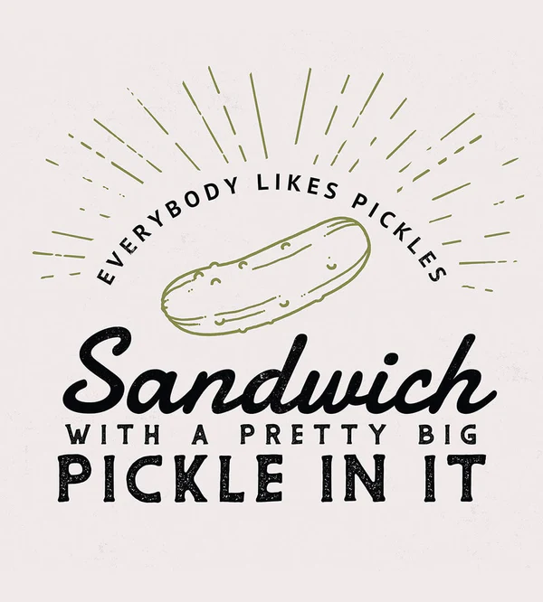

## Hi there hello
This is a collection of mostly hobby projects, in which I explore different programming languages.

I'm currently interested in Gleam, Elm, Rust, and Go.

---

If you are not interested then I suggest you click on the image below to watch a funny video.
Give it a try. It's super easy. Barely an inconvenience.

    

<!--
**basbiezemans/basbiezemans** is a ✨ _special_ ✨ repository because its `README.md` (this file) appears on your GitHub profile.

Here are some ideas to get you started:

- 🔭 I’m currently working on ...
- 🌱 I’m currently learning ...
- 👯 I’m looking to collaborate on ...
- 🤔 I’m looking for help with ...
- 💬 Ask me about ...
- 📫 How to reach me: ...
- ⚡ Fun fact: ...
-->
